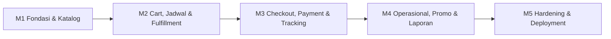

# UMKM Store Implementation Roadmap and Task Breakdown

| Informasi | Nilai |
|---|---|
| Versi | 1.0 |
| Tanggal | 25 Juni 2026 |
| Acuan | PRD v1.1, SRS v1.1, SDD v1.0, UI/UX Flow v1.0 |
| Strategi | Lima milestone yang dapat diuji dan didemonstrasikan |

## 1. Tujuan

Roadmap ini membagi UMKM Store menjadi unit pengembangan yang dapat diselesaikan, diuji, direview, dan di-commit secara mandiri. Setiap milestone menghasilkan software yang dapat dijalankan dan menjadi fondasi milestone berikutnya.

## 2. Definition of Done Global

Sebuah task dianggap selesai jika:

- Acceptance criteria task terpenuhi.
- Test baru ditulis dengan TDD dan lulus.
- Seluruh test yang sudah ada tetap lulus.
- Tidak ada error format atau migration.
- Tampilan pelanggan diverifikasi pada viewport 360, 390, 430, 1280, dan 1440 px jika task menyentuh UI.
- Fungsi desktop tidak hanya memperbesar layout mobile.
- Dokumentasi konfigurasi diperbarui jika ada environment variable baru.
- Perubahan di-commit dengan pesan yang terfokus.

## 3. Dependency Flow

## 4. Milestone 1 — Fondasi dan Katalog

**Hasil demonstrasi:** admin dapat login, mengatur toko, mengelola kategori/produk/varian/stok, dan pelanggan dapat melihat katalog serta detail produk pada mobile dan desktop.

| ID | Task | Dependensi | Verifikasi utama |
|---|---|---|---|
| M1-01 | Scaffold Laravel 13, Livewire 4, Tailwind 4, database test | - | Health test dan asset build |
| M1-02 | Shared enums, value objects, exception handling | M1-01 | Unit test Money, Phone, status |
| M1-03 | Autentikasi satu admin | M1-01 | Login/logout/protected routes |
| M1-04 | Store settings dan jam operasional | M1-02, M1-03 | Admin CRUD dan public store header |
| M1-05 | Schema kategori, produk, foto, varian | M1-02 | Migration dan model relationship |
| M1-06 | Schema option group, option value, add-on | M1-05 | Relationship dan validation |
| M1-07 | Admin kategori dan produk | M1-03–M1-06 | CRUD, archive, upload |
| M1-08 | Admin inventory awal dan mutasi stok | M1-05, M1-07 | Adjustment tidak membuat stok negatif |
| M1-09 | Storefront katalog | M1-04–M1-08 | Search, filter, pagination |
| M1-10 | Detail dan konfigurasi produk | M1-06, M1-09 | Pilihan wajib dan estimasi harga |
| M1-11 | Responsive/mobile-first QA | M1-09, M1-10 | Mobile + desktop layout penuh |
| M1-12 | Milestone verification dan dokumentasi setup | Semua M1 | Test suite, build, setup guide |

Rencana detail: `docs/superpowers/plans/2026-06-25-umkm-store-m1-foundation-catalog.md`.

## 5. Milestone 2 — Cart, Jadwal, Pickup, dan Delivery

**Hasil demonstrasi:** pelanggan dapat mengonfigurasi produk, mengelola keranjang, memilih pickup/delivery, memilih slot, menentukan titik peta, dan melihat ongkir.

| ID | Task | Dependensi | Verifikasi utama |
|---|---|---|---|
| M2-01 | Session cart contract dan line key | M1 | Konfigurasi sama tergabung |
| M2-02 | Cart pricing dan validasi ulang katalog | M2-01 | Harga browser tidak dipercaya |
| M2-03 | Cart UI mobile/desktop | M2-01, M2-02 | Update/remove/empty/invalid state |
| M2-04 | Schedule slot schema dan admin UI | M1 | Capacity/cutoff/close |
| M2-05 | Slot availability service | M2-04 | Full/past/closed ditolak |
| M2-06 | Fulfillment selector dan pickup flow | M2-03–M2-05 | Pickup tanpa alamat |
| M2-07 | MapProvider contract dan Google Maps adapter | M1 | HTTP fake dan route quote |
| M2-08 | Map picker UI | M2-07 | Manual pin dan permission denied |
| M2-09 | Delivery fee calculator dan radius | M2-07 | Pembulatan km dan batas 10 km |
| M2-10 | Delivery checkout preview | M2-08, M2-09 | Jarak/ongkir/error state |
| M2-11 | Milestone concurrency dan responsive QA | Semua M2 | Slot terakhir dan viewport |

## 6. Milestone 3 — Checkout, Midtrans, dan Tracking

**Hasil demonstrasi:** pelanggan membuat order, stok/slot dicadangkan, membayar di Midtrans sandbox, webhook memperbarui status, dan order dapat dilacak tanpa login.

| ID | Task | Dependensi | Verifikasi utama |
|---|---|---|---|
| M3-01 | Order, order item, snapshot, history schema | M2 | Snapshot tidak berubah |
| M3-02 | Inventory reservation schema dan service | M3-01 | Reserve/commit/release idempoten |
| M3-03 | CheckoutData dan checkout validation pipeline | M2, M3-01 | Revalidasi seluruh input |
| M3-04 | Atomic order creation dengan row lock | M3-02, M3-03 | Stok/slot terakhir tidak oversold |
| M3-05 | PaymentGateway contract dan Midtrans adapter | M3-01 | Snap request dengan HTTP fake |
| M3-06 | Compensation ketika token gagal | M3-04, M3-05 | Order batal dan reservasi lepas |
| M3-07 | Snap payment UI | M3-05, M3-06 | Open/close/pending/error |
| M3-08 | Webhook endpoint dan signature verification | M3-05 | Invalid payload tidak mengubah order |
| M3-09 | Payment notification job | M3-02, M3-08 | Duplicate webhook satu efek |
| M3-10 | Expiry scheduler dan reconciliation | M3-09 | Job dapat dijalankan ulang |
| M3-11 | Tracking code + WhatsApp | M3-01 | Generic error dan rate limit |
| M3-12 | Payment result/status UI | M3-07–M3-11 | Pending/paid/failed/expired |
| M3-13 | End-to-end sandbox verification | Semua M3 | Katalog sampai tracking |

## 7. Milestone 4 — Operasional, Promo, dan Laporan

**Hasil demonstrasi:** admin memproses pesanan, mengelola promo/voucher, melihat notifikasi, omzet, tren, produk terlaris, serta mengekspor CSV.

| ID | Task | Dependensi | Verifikasi utama |
|---|---|---|---|
| M4-01 | Order transition service | M3 | State machine pickup/delivery |
| M4-02 | Admin order index dan filter | M4-01 | Filter status/tanggal/fulfillment |
| M4-03 | Admin order detail dan timeline | M4-01 | Hanya CTA valid |
| M4-04 | Product promotion schema dan pricing | M3 | Periode dan snapshot harga |
| M4-05 | Voucher schema dan policy | M3 | Min, max, quota, one voucher |
| M4-06 | Voucher redemption idempotency | M3, M4-05 | Used count tidak ganda |
| M4-07 | Admin promo/voucher UI | M4-04–M4-06 | CRUD dan preview aturan |
| M4-08 | Database notifications | M3, M4-01 | Payment/order/low stock |
| M4-09 | Dashboard metrics queries | M3, M4-04 | Angka sesuai transaksi sah |
| M4-10 | Report filter dan CSV export | M4-09 | File mengikuti filter |
| M4-11 | Dashboard responsive/desktop QA | M4-08–M4-10 | Cards mobile, grid/table desktop |

## 8. Milestone 5 — Hardening dan Deployment

**Hasil demonstrasi:** aplikasi siap dipresentasikan dan mempunyai prosedur deployment production.

| ID | Task | Dependensi | Verifikasi utama |
|---|---|---|---|
| M5-01 | Security review dan rate limiting | M1–M4 | Auth, tracking, checkout, webhook |
| M5-02 | Upload hardening dan storage cleanup | M1 | MIME, size, orphan cleanup |
| M5-03 | Query/performance audit | M1–M4 | N+1, index, pagination |
| M5-04 | Accessibility audit | M1–M4 | Keyboard, focus, labels, contrast |
| M5-05 | Full responsive browser test | M1–M4 | 360/390/430/1280/1440 |
| M5-06 | Full regression and concurrency suite | M1–M4 | Semua critical scenario |
| M5-07 | Production environment guide | M5-01–M5-06 | HTTPS, queue, cron, storage |
| M5-08 | Backup/restore rehearsal | M5-07 | Restore database dan media |
| M5-09 | Demo seed dan presentation script | Semua | Reproducible demo |
| M5-10 | Release candidate verification | Semua | Zero critical defects |

## 9. Requirement Coverage

| Requirement group | Milestone |
|---|---|
| FR-CAT, FR-PRD, FR-ADM dasar | M1 |
| FR-CRT, FR-SLT, FR-PIC, FR-DLV | M2 |
| FR-CUS, FR-ORD, FR-STK reservasi, FR-PAY, FR-TRK | M3 |
| FR-PPM, FR-VCH, FR-RPT, FR-NTF, order operations | M4 |
| NFR-SEC, NFR-PER, NFR-REL, NFR-UX, NFR-CMP final | M5 dan diterapkan sejak M1 |

## 10. Risiko Urutan

- Jangan memulai Midtrans sebelum order dan reservasi stabil.
- Jangan membuat dashboard final sebelum definisi transaksi sah diterapkan.
- Jangan menghubungkan promo hanya di UI; pricing service harus menjadi sumber tunggal.
- Jangan menunda mobile/desktop QA sampai akhir; lakukan pada setiap milestone.
- Jangan memakai production key saat development.

