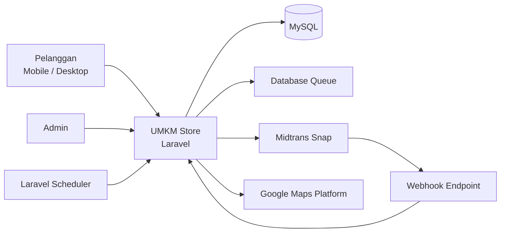
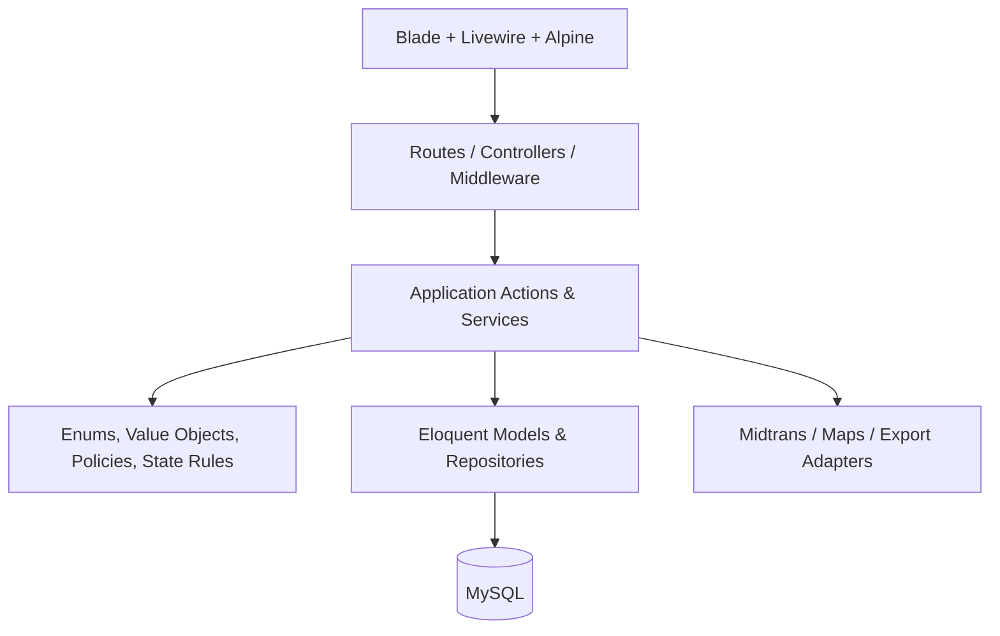
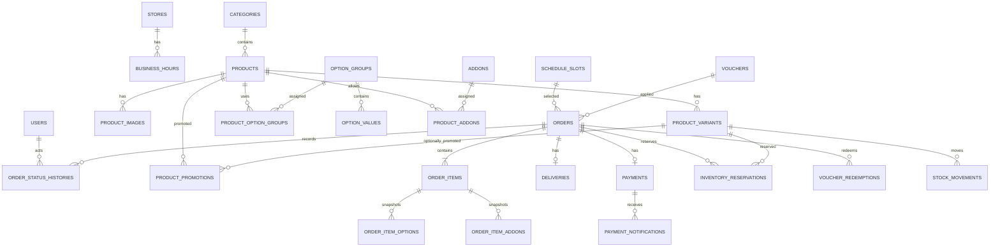
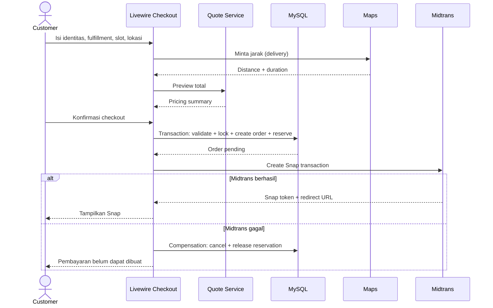
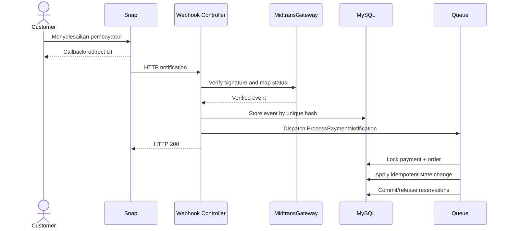
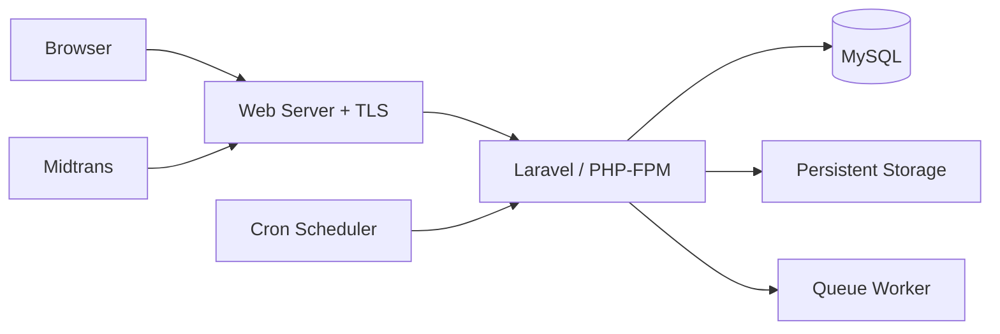

# Software Design Document (SDD)

## UMKM Store

| Informasi | Nilai |
|---|---|
| Versi | 1.0 |
| Tanggal | 25 Juni 2026 |
| Status | Draft untuk ditinjau |
| Acuan | PRD v1.1 dan SRS v1.1 |
| Arsitektur | Laravel modular monolith |
| Strategi UI | Mobile-first, desktop layout penuh |

## 1. Tujuan

Dokumen ini menerjemahkan kebutuhan UMKM Store menjadi rancangan teknis yang dapat diimplementasikan. SDD menetapkan arsitektur, batas modul, model data, kontrak service, alur transaksi, integrasi eksternal, keamanan, dan strategi tampilan responsif.

## 2. Keputusan Arsitektur

### 2.1 Pendekatan Terpilih

Sistem menggunakan **modular monolith** dalam satu aplikasi Laravel.

Alasan:

- Lebih mudah dipelajari, dijalankan, diuji, dan di-deploy daripada frontend dan backend terpisah.
- Transaksi stok, slot, order, voucher, dan pembayaran membutuhkan konsistensi database yang kuat.
- Blade dan Livewire cukup interaktif untuk katalog, keranjang, checkout, dan dashboard.
- Batas modul tetap dibuat jelas agar aplikasi tidak berubah menjadi kumpulan controller besar.

### 2.2 Prinsip Desain

1. Controller dan komponen Livewire tidak menyimpan aturan bisnis kompleks.
2. Aturan bisnis ditempatkan pada action/service yang terfokus.
3. Integrasi eksternal diakses melalui interface agar dapat diganti dan di-mock.
4. Operasi kritis memakai transaksi database dan row locking.
5. Data transaksi menyimpan snapshot agar tidak berubah mengikuti katalog.
6. Status pembayaran dipisahkan dari status operasional.
7. Mobile adalah baseline desain; desktop mempunyai layout desktop tersendiri.
8. Tidak ada network call eksternal selama row database sedang dikunci.

## 3. Technology Baseline

| Komponen | Pilihan |
|---|---|
| Local environment | Laragon 13 |
| Backend | Laravel 13 |
| PHP | 8.3 atau 8.4 |
| Database | MySQL 8.0+ |
| Server rendering | Blade |
| Interaktivitas | Livewire 4 |
| Micro-interaction | Alpine.js bawaan Livewire |
| Styling | Tailwind CSS 4 |
| Asset build | Vite |
| Payment | Midtrans Snap |
| Maps | Google Maps JavaScript API dan Routes API |
| Queue awal | Database queue |
| Cache/session awal | Database atau file untuk local; database direkomendasikan |
| Scheduler | Laravel Scheduler |
| Testing | Pest/PHPUnit melalui test runner Laravel |
| Export awal | CSV streaming |

Laravel 13 dipilih karena merupakan versi stabil saat dokumen dibuat dan membutuhkan minimal PHP 8.3. Livewire 4 kompatibel dengan Laravel modern dan membawa Alpine.js secara default. Tailwind menggunakan integrasi Vite.

### 3.1 Catatan Integrasi Peta

Google Maps dipilih sebagai implementasi awal karena mendukung:

- Peta interaktif untuk memilih titik pelanggan.
- Geocoding dan reverse geocoding.
- Routes API `computeRoutes` untuk jarak perjalanan.
- Mode kendaraan roda dua jika dibutuhkan untuk pengiriman lokal.

Google Maps memerlukan project Google Cloud, API key, dan billing. Implementasi wajib berada di balik `MapProvider` agar penyedia dapat diganti tanpa mengubah checkout.

## 4. Context Diagram



## 5. Container dan Layer



### 5.1 Presentation Layer

Tanggung jawab:

- Menampilkan data.
- Menangkap input.
- Menampilkan loading, validasi, dan error.
- Memanggil application action.

Tidak boleh:

- Menghitung total final.
- Mengurangi stok.
- Memutuskan validitas status pembayaran.
- Memanggil Midtrans atau Routes API secara langsung.

### 5.2 Application Layer

Berisi use case:

- Menambah dan memvalidasi keranjang.
- Menghitung checkout.
- Membuat order.
- Mencadangkan stok dan slot.
- Membuat pembayaran.
- Memproses webhook.
- Mengubah status order.
- Menghasilkan laporan.

### 5.3 Domain Layer

Berisi:

- Enum status.
- Value object uang, nomor WhatsApp, koordinat, dan jarak.
- Aturan transisi order.
- Kebijakan voucher.
- Kalkulasi harga dan ongkir.

### 5.4 Infrastructure Layer

Berisi implementasi teknis:

- Midtrans client.
- Google Maps client.
- CSV exporter.
- Penyimpanan gambar.
- Queue jobs.

## 6. Struktur Direktori Target

```text
app/
├── Actions/
│   ├── Cart/
│   ├── Checkout/
│   ├── Inventory/
│   ├── Orders/
│   ├── Payments/
│   ├── Promotions/
│   └── Reports/
├── Contracts/
│   ├── Maps/MapProvider.php
│   └── Payments/PaymentGateway.php
├── Data/
│   ├── CheckoutData.php
│   ├── DeliveryQuoteData.php
│   └── PaymentResultData.php
├── Enums/
│   ├── FulfillmentType.php
│   ├── OrderStatus.php
│   ├── PaymentStatus.php
│   └── StockMovementType.php
├── Exceptions/
│   ├── CheckoutValidationException.php
│   ├── InsufficientStockException.php
│   └── InvalidOrderTransitionException.php
├── Http/
│   ├── Controllers/
│   ├── Middleware/
│   └── Requests/
├── Jobs/
├── Livewire/
│   ├── Storefront/
│   └── Admin/
├── Models/
├── Notifications/
├── Policies/
├── Providers/
├── Services/
│   ├── Maps/GoogleMapsProvider.php
│   ├── Payments/MidtransGateway.php
│   └── Pricing/
└── ValueObjects/

resources/
├── css/app.css
├── js/app.js
└── views/
    ├── components/
    ├── layouts/
    ├── livewire/storefront/
    └── livewire/admin/

routes/
├── web.php
├── admin.php
├── webhook.php
└── console.php

tests/
├── Feature/
├── Integration/
└── Unit/
```

## 7. Pembagian Modul

| Modul | Tanggung jawab | Ketergantungan utama |
|---|---|---|
| Identity | Login, logout, session admin | Laravel Auth |
| Store Settings | Profil toko, lokasi, jam, tarif | Store |
| Catalog | Kategori, produk, foto, konfigurasi | Inventory, Promotions |
| Cart | Keranjang session dan validasi | Catalog, Pricing |
| Scheduling | Slot, kuota, cutoff | Orders |
| Fulfillment | Pickup, delivery, jarak, ongkir | Maps, Scheduling |
| Promotions | Promo produk dan voucher | Pricing, Orders |
| Inventory | Stok, reservasi, mutasi | Orders |
| Checkout | Orkestrasi checkout | Semua modul transaksi |
| Orders | Snapshot, status, histori | Inventory, Payments |
| Payments | Snap token, webhook, sinkronisasi | Midtrans |
| Tracking | Akses order tamu | Orders |
| Reporting | Omzet, tren, produk terlaris | Orders, Payments |
| Notifications | Notifikasi dashboard | Orders, Inventory |

## 8. Model Data

### 8.1 ERD Ringkas



### 8.2 Konvensi Database

- Nama tabel dan kolom menggunakan `snake_case` bahasa Inggris.
- Primary key menggunakan `BIGINT UNSIGNED`.
- Uang disimpan sebagai integer rupiah (`BIGINT UNSIGNED`), tanpa pecahan.
- Latitude dan longitude menggunakan `DECIMAL(10,7)`.
- Jarak disimpan dalam meter sebagai `UNSIGNED INTEGER`.
- Waktu disimpan dalam UTC; ditampilkan memakai zona waktu toko.
- Soft delete hanya dipakai untuk data master yang perlu diarsipkan.
- Transaksi tidak dihapus melalui UI.

### 8.3 Tabel Identitas dan Toko

#### `users`

| Kolom | Tipe | Aturan |
|---|---|---|
| id | bigint | PK |
| name | varchar(100) | required |
| email | varchar(190) | unique |
| password | varchar(255) | hashed |
| last_login_at | timestamp nullable | audit |
| timestamps | timestamps | |

Hanya satu record admin dipakai pada v1.

#### `stores`

| Kolom | Tipe | Aturan |
|---|---|---|
| id | bigint | PK |
| name | varchar(150) | required |
| slug | varchar(160) | unique |
| description | text nullable | |
| logo_path | varchar(255) nullable | |
| whatsapp | varchar(20) | normalized |
| address | text | required |
| latitude | decimal(10,7) | required |
| longitude | decimal(10,7) | required |
| timezone | varchar(64) | default `Asia/Jakarta` |
| base_delivery_fee | bigint unsigned | rupiah |
| delivery_fee_per_km | bigint unsigned | rupiah |
| max_delivery_distance_meters | int unsigned | default `10000` |
| low_stock_threshold | int unsigned | default `5` |
| timestamps | timestamps | |

#### `business_hours`

Menyimpan hari, jam buka, jam tutup, dan status libur.

### 8.4 Tabel Katalog

#### `categories`

- `id`, `name`, `slug`, `description`, `is_active`, `sort_order`, timestamps, soft delete.
- Unique index pada `slug`.

#### `products`

- `id`, `category_id`, `name`, `slug`, `description`.
- `sale_mode`: `ready_stock`, `preorder`, atau `both`.
- `is_active`, `is_featured`, timestamps, soft delete.
- Index pada `category_id`, `is_active`, dan `sale_mode`.

#### `product_images`

- `id`, `product_id`, `path`, `alt_text`, `sort_order`, `is_primary`.
- Satu gambar primer per produk ditegakkan oleh application rule.

#### `product_variants`

- `id`, `product_id`, `name`, `sku`, `price`.
- `stock_on_hand`, `reserved_stock`.
- `is_active`, `sort_order`, timestamps, soft delete.
- Unique index pada `sku`.
- Check/application constraints: stok tidak negatif dan `reserved_stock <= stock_on_hand`.

#### `option_groups`

- `id`, `name`, `selection_type`.
- `is_required`, `min_selected`, `max_selected`.
- Contoh: level pedas atau level gula.

#### `option_values`

- `id`, `option_group_id`, `name`, `price_delta`, `is_active`, `sort_order`.

#### `product_option_groups`

- Pivot `product_id`, `option_group_id`, `sort_order`.
- Unique composite index.

#### `addons`

- `id`, `name`, `price`, `is_active`, timestamps, soft delete.

#### `product_addons`

- Pivot `product_id`, `addon_id`.
- Unique composite index.

### 8.5 Tabel Promo

#### `product_promotions`

- `id`, `product_id`, `product_variant_id nullable`.
- `discount_type`: `fixed_price`, `fixed_amount`, `percentage`.
- `discount_value`, `max_discount nullable`.
- `starts_at`, `ends_at`, `is_active`.
- Index pada rentang waktu dan target.

#### `vouchers`

- `id`, `code`, `discount_type`, `discount_value`.
- `minimum_subtotal`, `maximum_discount nullable`.
- `usage_limit`, `used_count`.
- `starts_at`, `ends_at`, `is_active`.
- `applies_to_delivery` default false.
- Unique index pada uppercase `code`.

#### `voucher_redemptions`

- `id`, `voucher_id`, `order_id`, `discount_amount`, `redeemed_at`.
- Unique index pada `order_id`.

### 8.6 Tabel Jadwal

#### `schedule_slots`

- `id`, `fulfillment_type`: `pickup`, `delivery`, atau `both`.
- `starts_at`, `ends_at`, `order_cutoff_at`.
- `capacity`, `reserved_capacity`, `confirmed_capacity`.
- `is_closed`, timestamps.
- Index pada waktu dan tipe.

Kuota tersedia:

```text
capacity - reserved_capacity - confirmed_capacity
```

### 8.7 Tabel Order

#### `orders`

| Kelompok | Kolom utama |
|---|---|
| Identity | `id`, `order_code` unique |
| Customer | `customer_name`, `whatsapp_normalized`, `whatsapp_display` |
| State | `payment_status`, `order_status`, `fulfillment_type` |
| Schedule | `schedule_slot_id`, `scheduled_at` |
| Money | `subtotal`, `product_discount`, `voucher_discount`, `delivery_fee`, `grand_total` |
| Voucher | `voucher_id nullable`, `voucher_code nullable` |
| Notes | `customer_note`, `cancellation_reason` |
| Time | `payment_expires_at`, `paid_at`, `completed_at`, timestamps |

Index:

- Unique `order_code`.
- Composite `(whatsapp_normalized, order_code)`.
- Index `payment_status`, `order_status`, `created_at`, `scheduled_at`.

#### `order_items`

Menyimpan snapshot:

- `order_id`, `product_id nullable`, `product_variant_id nullable`.
- `product_name`, `variant_name`, `sku`.
- `unit_base_price`, `unit_discount`, `unit_final_price`.
- `quantity`, `line_subtotal`, `note`.

#### `order_item_options`

- `order_item_id`, `group_name`, `value_name`, `price_delta`.

#### `order_item_addons`

- `order_item_id`, `addon_name`, `unit_price`, `quantity`, `subtotal`.

#### `order_status_histories`

- `order_id`, `from_status`, `to_status`.
- `actor_type`, `actor_id nullable`.
- `reason nullable`, `metadata json nullable`, `created_at`.

### 8.8 Tabel Delivery

#### `deliveries`

- `id`, `order_id` unique.
- `recipient_name`, `recipient_phone`.
- `address`, `address_note`.
- `latitude`, `longitude`.
- `distance_meters`, `duration_seconds nullable`.
- `base_fee_snapshot`, `fee_per_km_snapshot`, `delivery_fee`.
- `provider`, `provider_route_id nullable`.
- `route_metadata json nullable`.

Data mentah provider yang sensitif atau berlebihan tidak disimpan.

### 8.9 Tabel Inventory

#### `inventory_reservations`

- `id`, `order_id`, `product_variant_id`.
- `quantity`, `status`: `active`, `committed`, `released`.
- `expires_at`, `committed_at nullable`, `released_at nullable`.
- Unique composite `(order_id, product_variant_id)`.
- Index `(status, expires_at)`.

#### `stock_movements`

- `id`, `product_variant_id`, `order_id nullable`.
- `type`: `sale`, `restock`, `adjustment_in`, `adjustment_out`, `refund`.
- `quantity_delta` signed.
- `stock_before`, `stock_after`.
- `note nullable`, `created_by nullable`, `created_at`.

Reservasi tidak mengubah `stock_on_hand`; reservasi menaikkan `reserved_stock`. Pembayaran berhasil mengurangi keduanya. Pelepasan hanya mengurangi `reserved_stock`.

### 8.10 Tabel Pembayaran

#### `payments`

- `id`, `order_id` unique.
- `gateway` default `midtrans`.
- `gateway_order_id` unique.
- `snap_token` encrypted nullable.
- `redirect_url` nullable.
- `status`.
- `gross_amount`.
- `payment_type nullable`.
- `transaction_id nullable`, `fraud_status nullable`.
- `gateway_transaction_time nullable`.
- `paid_at nullable`, `expired_at nullable`, timestamps.

#### `payment_notifications`

- `id`, `payment_id`.
- `event_hash` unique.
- `transaction_status`, `status_code`.
- `signature_valid`.
- `payload_redacted json`.
- `processed_at nullable`, `processing_result`.
- timestamps.

### 8.11 Tabel Notifikasi Admin

Menggunakan Laravel database notifications atau tabel `admin_notifications` dengan:

- tipe, judul, pesan, URL target, data JSON, `read_at`, timestamps.

## 9. Enum dan Value Object

### 9.1 Enum

```php
enum FulfillmentType: string
{
    case Pickup = 'pickup';
    case Delivery = 'delivery';
}

enum PaymentStatus: string
{
    case Pending = 'pending';
    case Paid = 'paid';
    case Failed = 'failed';
    case Expired = 'expired';
    case Cancelled = 'cancelled';
    case Refunded = 'refunded';
}

enum OrderStatus: string
{
    case AwaitingPayment = 'awaiting_payment';
    case Confirmed = 'confirmed';
    case Processing = 'processing';
    case ReadyForPickup = 'ready_for_pickup';
    case OutForDelivery = 'out_for_delivery';
    case Completed = 'completed';
    case Cancelled = 'cancelled';
}
```

### 9.2 Value Object

- `Money`: integer rupiah, tidak menerima nilai negatif kecuali delta internal.
- `NormalizedPhone`: mengubah `08...` menjadi format kanonis `628...`.
- `Coordinates`: latitude dan longitude tervalidasi.
- `Distance`: meter dan konversi display kilometer.
- `OrderCode`: format publik nonsekuensial.

Format order code:

```text
UMK-YYYYMMDD-XXXXXX
```

Bagian acak harus cukup kuat agar kode tidak mudah ditebak. Tracking tetap membutuhkan nomor WhatsApp.

## 10. Kontrak Service Utama

### 10.1 Pricing

```php
interface CartPricingService
{
    public function calculate(CartData $cart, ?string $voucherCode): PricingSummaryData;
}
```

Hasil:

- Lines tervalidasi.
- Subtotal.
- Promo produk.
- Diskon voucher.
- Total item.

### 10.2 Maps

```php
interface MapProvider
{
    public function quoteRoute(
        Coordinates $origin,
        Coordinates $destination
    ): RouteQuoteData;
}
```

`RouteQuoteData` memuat:

- `distanceMeters`
- `durationSeconds`
- `provider`
- metadata minimum

Provider awal memakai `computeRoutes` dan hanya meminta field yang dibutuhkan.

### 10.3 Ongkir

```php
interface DeliveryFeeCalculator
{
    public function calculate(
        int $baseFee,
        int $feePerKilometer,
        int $distanceMeters
    ): Money;
}
```

Aturan:

```text
billable_km = ceil(distance_meters / 1000)
delivery_fee = base_fee + (billable_km × fee_per_km)
```

Jarak disimpan dalam meter. Tampilan boleh menunjukkan satu angka desimal, tetapi penagihan menggunakan kilometer dibulatkan ke atas.

### 10.4 Payment Gateway

```php
interface PaymentGateway
{
    public function createTransaction(Order $order): PaymentSessionData;

    public function verifyNotification(array $payload): VerifiedPaymentEventData;

    public function fetchStatus(string $gatewayOrderId): VerifiedPaymentEventData;
}
```

### 10.5 Order Transition

```php
interface OrderTransitionService
{
    public function transition(
        Order $order,
        OrderStatus $target,
        TransitionContext $context
    ): Order;
}
```

## 11. Alur Katalog dan Keranjang

### 11.1 Cart Storage

Keranjang pelanggan disimpan di Laravel session karena:

- Pelanggan tidak mempunyai akun.
- Tidak perlu sinkronisasi lintas perangkat pada v1.
- Mengurangi tabel dan cleanup data sementara.

Setiap cart line menyimpan identifier dan input pengguna, bukan harga tepercaya:

```json
{
  "line_key": "hash-konfigurasi",
  "product_id": 10,
  "variant_id": 24,
  "option_value_ids": [7],
  "addon_ids": [3, 4],
  "quantity": 2,
  "note": "Es sedikit"
}
```

Harga selalu dimuat ulang dari database.

### 11.2 Line Key

`line_key` adalah hash stabil dari:

- product ID
- variant ID
- option IDs terurut
- addon IDs terurut
- catatan ternormalisasi

Konfigurasi sama digabung; konfigurasi berbeda menjadi baris berbeda.

## 12. Alur Checkout



### 12.1 Checkout Pipeline

1. Normalisasi identitas pelanggan.
2. Muat ulang cart dari database.
3. Validasi produk, varian, option, add-on, dan kuantitas.
4. Validasi promo dan voucher.
5. Validasi slot.
6. Jika delivery, hitung ulang rute pada server.
7. Tolak jarak di atas 10.000 meter.
8. Hitung ongkir dan total final.
9. Mulai transaksi database.
10. Lock baris `product_variants`, `schedule_slots`, dan voucher yang relevan.
11. Validasi ulang stok dan kuota setelah lock.
12. Buat order dan snapshot item.
13. Buat reservasi serta naikkan `reserved_stock`/`reserved_capacity`.
14. Commit transaksi.
15. Panggil Midtrans.
16. Simpan Snap token dan redirect URL.
17. Jika gagal, jalankan compensation action idempoten.

### 12.2 Mengapa Midtrans Dipanggil Setelah Commit

Network call tidak dilakukan di dalam transaksi database agar:

- Lock tidak ditahan selama jaringan lambat.
- Risiko deadlock menurun.
- Database tidak menunggu timeout eksternal.

Kegagalan Midtrans diselesaikan dengan tindakan kompensasi yang membatalkan order dan melepaskan reservasi.

## 13. Alur Pembayaran dan Webhook



### 13.1 Webhook Security

- Route webhook tidak memakai session auth.
- Route dikecualikan dari CSRF, tetapi tetap memakai signature verification.
- Payload divalidasi sebelum diproses.
- Nominal payload harus sama dengan `payments.gross_amount`.
- `gateway_order_id` harus ditemukan.
- Webhook disimpan dengan `event_hash` unik.
- Response cepat diberikan; pemrosesan bisnis dilakukan melalui queue.

### 13.2 Status Mapping

| Midtrans | Kondisi tambahan | Internal |
|---|---|---|
| `pending` | | `pending` |
| `capture` | fraud status accept | `paid` |
| `settlement` | | `paid` |
| `deny` | | `failed` |
| `cancel` | | `cancelled` |
| `expire` | | `expired` |
| `refund` / `partial_refund` | sesuai nominal | `refunded` atau metadata partial refund |

### 13.3 Efek Status

#### Menjadi `paid`

- Lock payment, order, reservations, variants, dan slot.
- Abaikan jika sudah paid.
- Ubah reservasi inventory menjadi committed.
- Kurangi `stock_on_hand` dan `reserved_stock`.
- Pindahkan slot dari reserved ke confirmed.
- Catat stock movement.
- Catat voucher redemption dan naikkan `used_count`.
- Set order `confirmed`.
- Buat notifikasi admin.

#### Menjadi gagal, batal, atau kedaluwarsa

- Ubah reservasi aktif menjadi released.
- Kurangi `reserved_stock`.
- Kurangi `reserved_capacity`.
- Batalkan order jika belum final.
- Voucher belum dianggap terpakai.

## 14. Scheduler dan Queue

### 14.1 Scheduled Commands

| Jadwal | Command | Fungsi |
|---|---|---|
| Setiap menit | `orders:expire-pending` | Menangani order melewati expiry |
| Setiap 5 menit | `inventory:release-stale-reservations` | Safety net reservasi |
| Harian | `notifications:generate-low-stock` | Notifikasi stok |
| Harian | `payments:reconcile-pending` | Opsional: sinkronisasi transaksi pending lama |

Semua command harus idempoten.

### 14.2 Jobs

- `ProcessPaymentNotification`
- `ReleaseExpiredOrderReservation`
- `GenerateLowStockNotifications`
- `ExportTransactionReport`

Database queue cukup untuk versi pertama. Redis dapat digunakan setelah kebutuhan throughput meningkat.

## 15. State Machine Order

| Status asal | Status tujuan valid |
|---|---|
| awaiting_payment | confirmed, cancelled |
| confirmed | processing, cancelled |
| processing + pickup | ready_for_pickup, cancelled |
| processing + delivery | out_for_delivery, cancelled |
| ready_for_pickup | completed |
| out_for_delivery | completed |
| completed | tidak ada |
| cancelled | tidak ada |

Validasi tambahan:

- `confirmed` hanya setelah pembayaran `paid`.
- Cabang pickup tidak boleh memasuki `out_for_delivery`.
- Cabang delivery tidak boleh memasuki `ready_for_pickup`.
- Status final hanya dapat dikoreksi melalui prosedur audit khusus, bukan UI biasa.

## 16. HTTP Routes

### 16.1 Public

| Method | Path | Fungsi |
|---|---|---|
| GET | `/` | Beranda/katalog |
| GET | `/products/{product:slug}` | Detail produk |
| GET | `/cart` | Keranjang |
| GET | `/checkout` | Checkout |
| GET | `/orders/track` | Form tracking |
| POST | `/orders/track` | Pencarian tracking |
| GET | `/orders/{orderCode}/payment` | Lanjut pembayaran dengan token aman |
| GET | `/payment/finish` | Landing setelah Snap |

Sebagian interaksi dilakukan sebagai action Livewire pada route halaman.

### 16.2 Admin

Prefix `/admin`, middleware `auth` dan rate limit:

- dashboard
- settings
- categories
- products
- variants/options/add-ons
- inventory
- schedule-slots
- orders
- promotions
- vouchers
- reports
- notifications

### 16.3 Webhook

| Method | Path | Middleware |
|---|---|---|
| POST | `/webhooks/midtrans` | throttle khusus, signature verification |

## 17. Livewire Component Map

### 17.1 Storefront

| Component | Fungsi |
|---|---|
| `CatalogPage` | search, category, sale mode, pagination |
| `ProductDetailPage` | variant, option, add-on, quantity |
| `CartPage` | update, remove, subtotal |
| `CheckoutPage` | identity, fulfillment, slot, voucher, quote |
| `OrderTrackingPage` | lookup aman |
| `OrderStatusPage` | ringkasan setelah tracking |

### 17.2 Admin

| Component | Fungsi |
|---|---|
| `DashboardPage` | metrics dan alerts |
| `ProductIndex` / `ProductForm` | katalog |
| `InventoryPage` | stock adjustment |
| `ScheduleSlotPage` | slot dan kuota |
| `OrderIndex` / `OrderShow` | operasional order |
| `PromotionPage` / `VoucherPage` | promo |
| `ReportPage` | filter dan ekspor |
| `NotificationPanel` | notifikasi dashboard |

Komponen kompleks harus dipecah menjadi child component atau Blade component. Satu komponen tidak boleh mengelola beberapa domain bisnis sekaligus.

## 18. Mobile-First dan Desktop Design System

### 18.1 Breakpoint

Mengikuti breakpoint Tailwind:

| Mode | Lebar | Pola layout |
|---|---:|---|
| Mobile baseline | < 640 px | Satu kolom, bottom actions |
| Large mobile/small tablet | ≥ 640 px | Grid terbatas |
| Tablet | ≥ 768 px | Dua kolom bila relevan |
| Desktop | ≥ 1024 px | Navigasi desktop, panel berdampingan |
| Wide desktop | ≥ 1280 px | Container lebar dan grid lebih padat |

### 18.2 Storefront Mobile

- Header ringkas dengan logo, search, dan cart.
- Filter kategori dapat digeser horizontal.
- Produk memakai satu atau dua kolom sesuai lebar.
- Detail produk memakai galeri, konfigurasi, lalu sticky add-to-cart.
- Checkout berbentuk langkah/section vertikal.
- Ringkasan total dan CTA tersedia dekat bagian bawah.
- Bottom navigation dapat dipakai untuk Beranda, Cari, Keranjang, dan Lacak.

### 18.3 Storefront Desktop

- Header horizontal lengkap.
- Search dan kategori terlihat tanpa membuka drawer.
- Grid produk 3–4 kolom.
- Detail produk memakai galeri kiri dan konfigurasi kanan.
- Checkout memakai form kiri dan sticky order summary kanan.
- Hover state tersedia pada card, tombol, menu, dan aksi cepat.
- Informasi penting tetap tersedia melalui fokus, klik, dan teks.

### 18.4 Admin

- Mobile: sidebar menjadi drawer, tabel penting menjadi cards atau horizontal scroll terkontrol.
- Desktop: sidebar permanen, tabel penuh, filter sejajar, dan panel dashboard multi-kolom.
- Operasi massal dihindari pada v1 agar mobile admin tetap aman.

### 18.5 Interaction Rules

- Target sentuh minimum 44 × 44 CSS pixel.
- Gunakan `:focus-visible` untuk keyboard.
- Hover hanya aktif sebagai enhancement pada perangkat yang mendukung hover.
- Loading state tersedia pada semua action Livewire.
- Tombol pembayaran dan checkout mencegah submit ganda.
- Modal tidak menjadi satu-satunya cara menyelesaikan tugas kritis pada mobile.

## 19. Validasi dan Error Mapping

### 19.1 Form Validation

- Form Request untuk controller.
- Livewire validation rules untuk component input.
- Application action tetap memvalidasi invariant bisnis.

### 19.2 Error Domain

| Exception | Pesan pengguna |
|---|---|
| `InsufficientStockException` | Stok berubah. Perbarui keranjang dan coba lagi. |
| `SlotUnavailableException` | Jadwal sudah penuh atau tidak tersedia. |
| `DeliveryOutOfRangeException` | Alamat berada di luar jangkauan 10 km. |
| `MapProviderException` | Jarak belum dapat dihitung. Silakan coba kembali. |
| `VoucherInvalidException` | Voucher tidak dapat digunakan beserta alasannya. |
| `PaymentGatewayException` | Pembayaran belum dapat dibuat. Pesanan tidak ditagihkan. |
| `InvalidOrderTransitionException` | Status pesanan tidak dapat diubah dari kondisi saat ini. |

Detail teknis masuk log dengan correlation ID.

## 20. Keamanan

### 20.1 Admin

- Laravel session authentication.
- Password hashing default Laravel.
- Session regeneration saat login.
- Logout menghapus session.
- Rate limit login.
- Semua route admin memakai middleware `auth`.

### 20.2 Customer Tracking

- Kombinasi order code dan nomor WhatsApp ternormalisasi.
- Pesan gagal bersifat generik.
- Rate limit per IP dan fingerprint session.
- Tidak menaruh nomor WhatsApp di URL.

### 20.3 Upload

- Maksimal 2 MB per gambar pada v1.
- MIME: JPEG, PNG, WebP.
- Nama file dibuat server.
- File executable ditolak.
- Gambar disimpan pada storage disk, bukan public path langsung.

### 20.4 Secret

- Midtrans Server Key hanya server-side.
- Google Routes API key dibatasi untuk server.
- Browser Maps key dibatasi HTTP referrer.
- `.env` tidak masuk Git.
- Payload log disanitasi.

### 20.5 Rate Limit Awal

| Endpoint | Batas awal |
|---|---|
| Login admin | 5 percobaan/menit per email+IP |
| Tracking | 10 percobaan/menit per IP |
| Checkout | 5 order/menit per session+IP |
| Webhook | 120 request/menit per IP, tetap wajib signature |

Nilai dapat disesuaikan setelah pengujian.

## 21. Performance

- Katalog memakai pagination 12–20 produk.
- Gambar menggunakan WebP bila tersedia, responsive sizes, dan lazy loading.
- Eager loading mencegah N+1.
- Query dashboard menggunakan agregasi dan index.
- Hasil store settings dapat di-cache.
- Search awal memakai index dan `LIKE` terkontrol; full-text search belum diperlukan.
- Livewire request dibatasi pada state yang benar-benar berubah.
- Grafik dashboard dimuat setelah metrik utama.
- CSV besar dibuat melalui queue.

## 22. Logging dan Observability

Log channel:

- `application`
- `payments`
- `integrations`
- `security`

Setiap checkout mempunyai correlation ID. Log pembayaran memuat:

- order code
- gateway order ID
- event hash
- status lama dan baru
- hasil pemrosesan

Log tidak memuat Server Key, Snap token utuh, alamat lengkap, atau nomor WhatsApp utuh.

## 23. Testing Design

### 23.1 Unit

- Money dan rounding.
- Delivery fee.
- Product promotion.
- Voucher policy.
- Order transition.
- Phone normalization.
- Reservation calculations.

### 23.2 Feature

- Katalog dan konfigurasi produk.
- Session cart.
- Pickup checkout.
- Delivery checkout.
- Admin CRUD.
- Tracking.
- Report filter dan CSV.

### 23.3 Integration

- Midtrans adapter memakai fake HTTP.
- Google Maps adapter memakai fake HTTP.
- Webhook valid, invalid, dan duplicate.
- Queue dan scheduler.

### 23.4 Concurrency

Uji integrasi khusus:

- Dua transaksi memesan stok terakhir.
- Dua transaksi mengambil slot terakhir.
- Webhook paid dan expiry diproses berdekatan.
- Job release dijalankan dua kali.

### 23.5 UI Viewport

- Mobile: 360, 390, 430 CSS pixel.
- Desktop: 1280 dan 1440 CSS pixel.
- Verifikasi tidak ada horizontal overflow pada storefront.
- Verifikasi desktop berpindah ke header, grid, panel, dan tabel desktop.
- Verifikasi hover dan focus state.

## 24. Deployment Topology

### 24.1 Local

```text
Laragon
├── Apache/Nginx
├── PHP 8.3/8.4
├── MySQL 8
├── Node.js + Vite
├── Queue worker terminal
└── Scheduler via artisan schedule:work
```

Webhook sandbox membutuhkan tunnel HTTPS publik selama development.

### 24.2 Production



Kebutuhan production:

- HTTPS.
- Queue worker yang dijaga process manager.
- Cron menjalankan `schedule:run`.
- Backup database dan media.
- Environment production terpisah.
- Webhook URL publik.

## 25. Traceability Modul ke SRS

| Modul | Requirement utama |
|---|---|
| Catalog | FR-CAT, FR-PRD |
| Cart | FR-CRT |
| Customer/Tracking | FR-CUS, FR-TRK |
| Scheduling | FR-SLT |
| Fulfillment | FR-PIC, FR-DLV |
| Promotions | FR-PPM, FR-VCH |
| Orders | FR-ORD, BR-004, BR-010, BR-011 |
| Inventory | FR-STK, BR-003, BR-012 |
| Payments | FR-PAY, BR-008 |
| Admin | FR-ADM |
| Reporting | FR-RPT, FR-NTF, BR-009 |
| Responsive UI | NFR-UX, NFR-CMP |
| Security | NFR-SEC |
| Reliability | NFR-REL |

## 26. Keputusan yang Ditunda

Keputusan berikut tidak menghalangi desain dan diputuskan saat setup:

- Apache atau Nginx pada Laragon.
- Database session atau file session untuk local.
- Package ekspor tambahan jika CSV tidak cukup.
- Redis setelah kebutuhan performa terbukti.
- Migrasi Google Maps ke provider lain melalui `MapProvider`.

Tidak ada keputusan bisnis inti yang masih terbuka.

## 27. Sumber Teknis Resmi

- Laravel 13 release notes: https://laravel.com/docs/13.x/releases
- Livewire 4 installation: https://livewire.laravel.com/docs/4.x/installation
- Tailwind CSS Laravel/Vite guide: https://tailwindcss.com/docs/installation/framework-guides/laravel/vite
- Midtrans Snap integration: https://docs.midtrans.com/docs/snap-snap-integration-guide
- Midtrans webhooks: https://docs.midtrans.com/docs/https-notification-webhooks
- Google Routes API: https://developers.google.com/maps/documentation/routes
- Google Maps JavaScript API: https://developers.google.com/maps/documentation/javascript/overview

