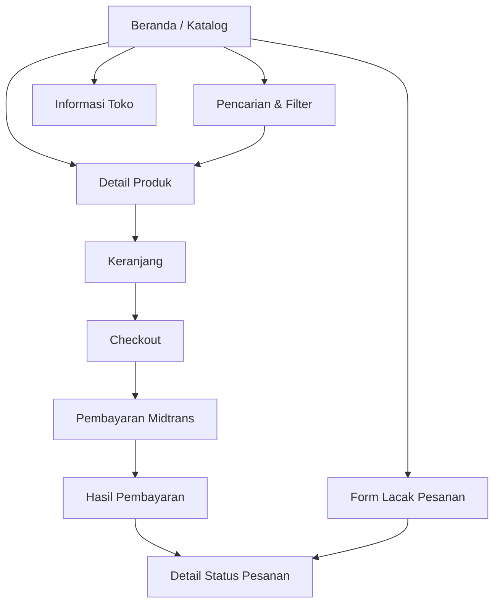
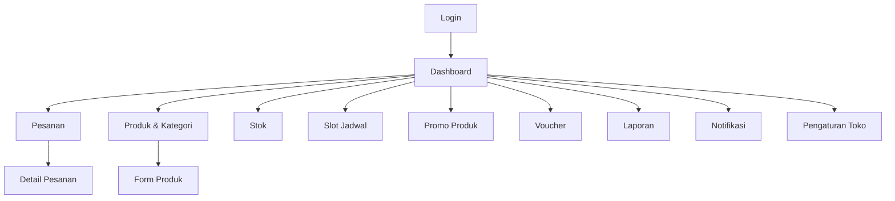
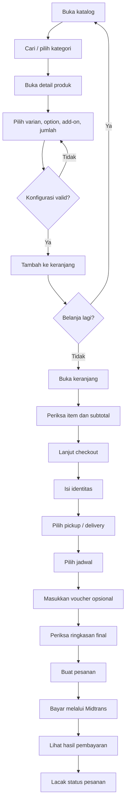
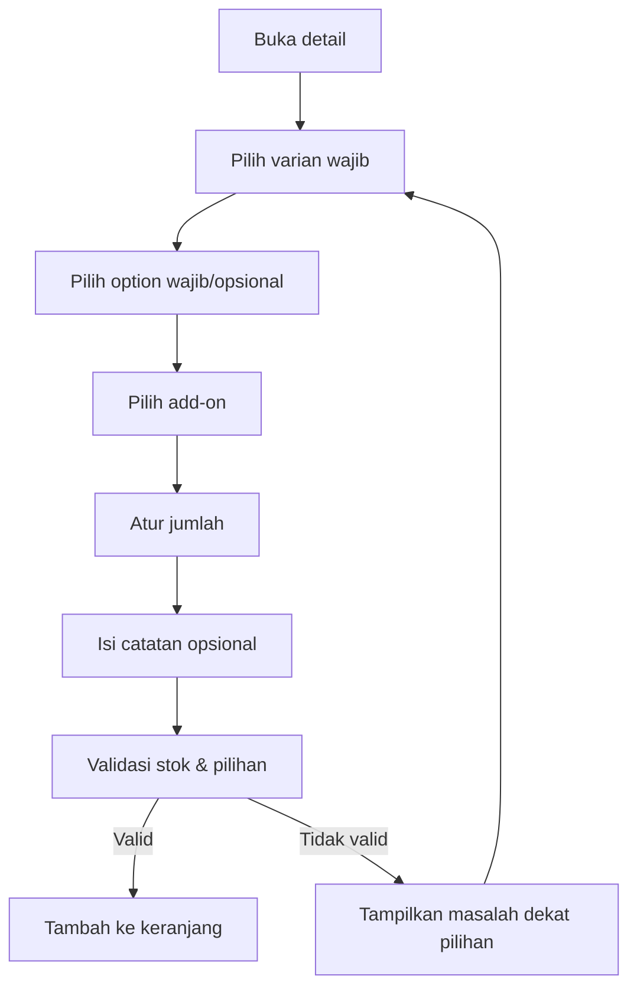
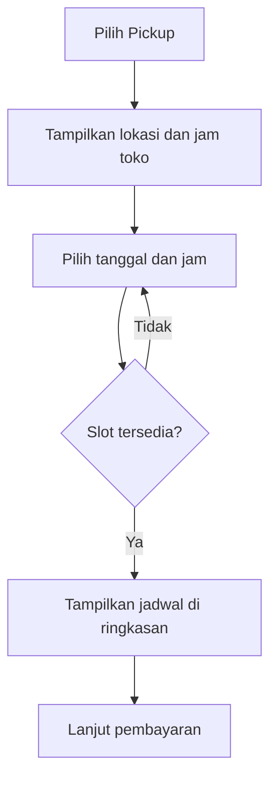
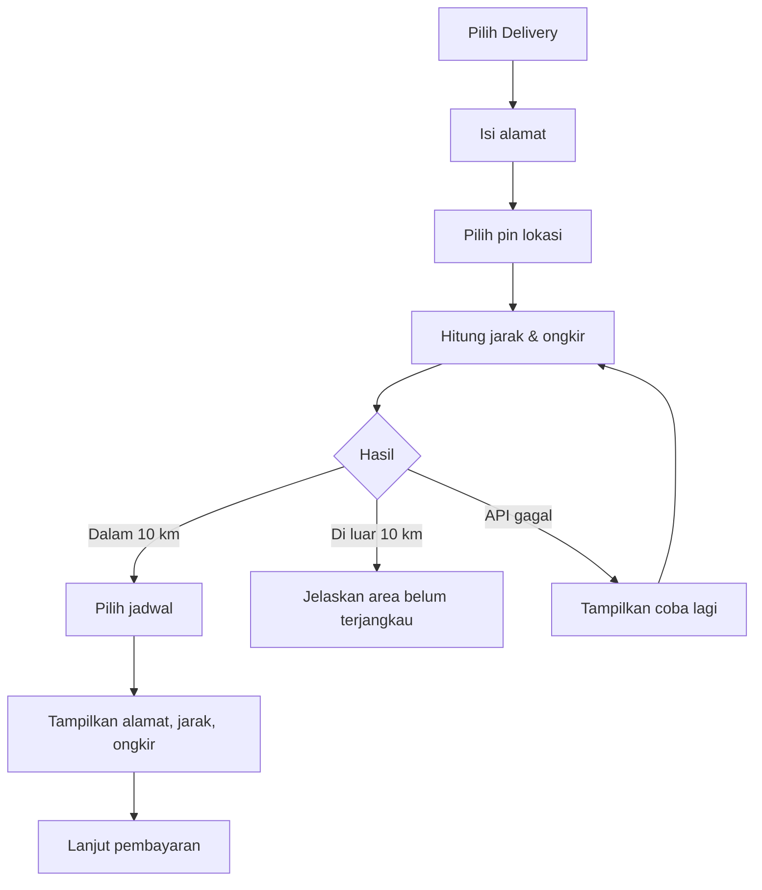
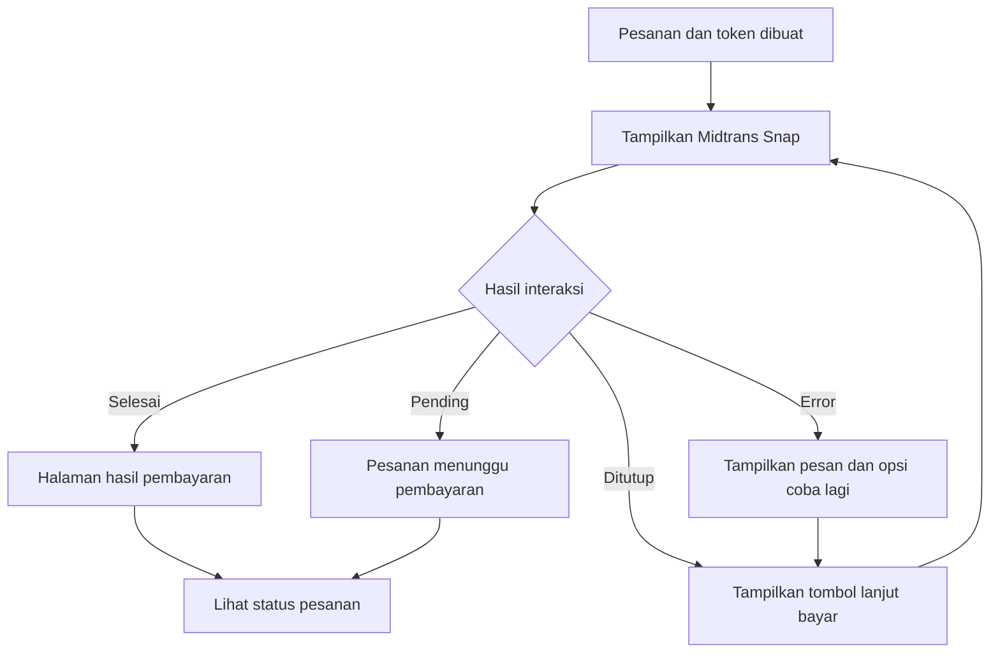
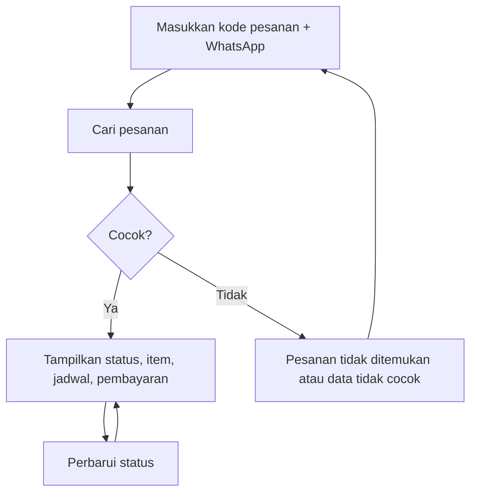
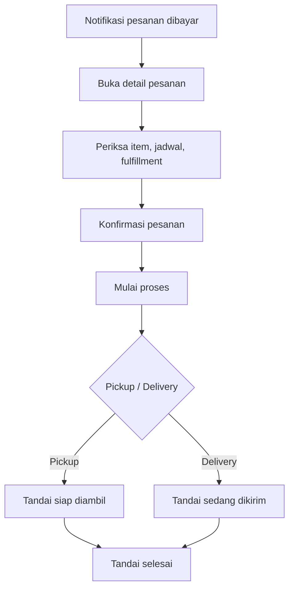
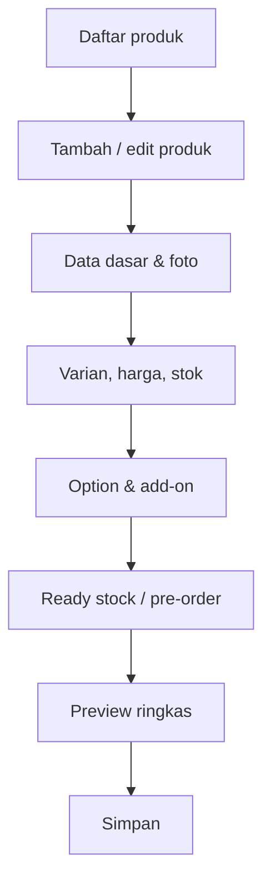

# UI/UX Flow Specification

## UMKM Store

| Informasi | Nilai |
|---|---|
| Versi | 1.0 |
| Tanggal | 25 Juni 2026 |
| Status | Draft untuk ditinjau |
| Acuan | PRD v1.1, SRS v1.1, SDD v1.0 |
| Pendekatan | Mobile-first, desktop layout penuh |
| Bentuk dokumen | Teks dan diagram Mermaid |

## 1. Tujuan

Dokumen ini menetapkan arsitektur informasi, navigasi, alur pengguna, struktur layar, interaksi, validasi, dan state UI untuk UMKM Store.

Target utama adalah pelanggan yang mengakses melalui ponsel. Pada PC dan laptop, aplikasi menampilkan layout desktop penuh, bukan tampilan mobile yang diperbesar.

## 2. Prinsip Pengalaman

1. Pelanggan dapat menyelesaikan pembelian tanpa membuat akun.
2. Informasi harga, stok, jadwal, ongkir, dan total harus terlihat sebelum pembayaran.
3. Satu layar mempunyai satu tindakan utama yang jelas.
4. Form checkout dibagi dalam urutan yang alami dan tidak terasa seperti formulir panjang tanpa arah.
5. Kesalahan ditampilkan dekat sumber masalah dan menjelaskan cara memperbaikinya.
6. Interaksi penting tidak hanya bergantung pada warna, hover, atau ikon.
7. Mobile mengutamakan jangkauan ibu jari dan tindakan sentuh.
8. Desktop memanfaatkan navigasi horizontal, grid, tabel, panel, hover, dan ruang yang lebih luas.
9. Status pembayaran dan status pesanan dijelaskan dengan bahasa pelanggan.
10. Pelanggan tidak kehilangan data form karena validasi lokal atau kegagalan API yang dapat dicoba ulang.

## 3. Pengguna dan Tujuan

### 3.1 Pelanggan

Tujuan utama:

- Menemukan produk yang diinginkan.
- Mengetahui harga dan ketersediaan.
- Menyesuaikan varian dan topping.
- Memesan untuk pickup atau delivery.
- Membayar dengan aman.
- Melacak status tanpa login.

### 3.2 Admin

Tujuan utama:

- Mengetahui kondisi toko saat ini.
- Memproses pesanan baru dengan cepat.
- Mengelola katalog dan stok.
- Mengatur slot serta promo.
- Memeriksa pembayaran dan laporan.

## 4. Arsitektur Informasi

### 4.1 Sitemap Pelanggan



### 4.2 Sitemap Admin



## 5. Sistem Navigasi

### 5.1 Navigasi Pelanggan Mobile

Bottom navigation:

| Item | Tujuan |
|---|---|
| Beranda | Katalog utama |
| Cari | Fokus ke pencarian dan filter |
| Keranjang | Keranjang dengan badge jumlah |
| Lacak | Form pelacakan pesanan |

Aturan:

- Maksimal empat item agar label tetap terbaca.
- Aktif ditandai dengan ikon, teks, dan warna.
- Bottom navigation tidak ditampilkan saat Snap mengambil alih layar.
- Pada checkout, navigasi dapat disederhanakan agar pelanggan fokus.

Header mobile:

- Logo atau nama toko.
- Tombol search pada beranda.
- Tombol kembali pada layar turunan.
- Ikon keranjang dengan badge bila konteks memerlukannya.

### 5.2 Navigasi Pelanggan Desktop

Header horizontal:

- Logo/nama toko.
- Beranda.
- Kategori atau menu produk.
- Search bar.
- Lacak Pesanan.
- Informasi Toko.
- Keranjang dengan jumlah item.

Desktop menggunakan hover state untuk menu, kartu, dan tombol. Fungsi tetap dapat diakses dengan klik dan keyboard.

### 5.3 Navigasi Admin Mobile

- Top bar berisi judul halaman, tombol menu, dan notifikasi.
- Sidebar berubah menjadi drawer.
- Menu utama: Dashboard, Pesanan, Produk, Stok, Jadwal, Promo, Laporan, Pengaturan.
- Tombol tambah berada pada area yang mudah dijangkau atau sebagai CTA di header.

### 5.4 Navigasi Admin Desktop

- Sidebar permanen.
- Area konten mempunyai header halaman, breadcrumb jika diperlukan, filter, dan aksi.
- Notifikasi dan profil admin berada di top bar.
- Tabel dan filter ditampilkan penuh.

## 6. Alur Utama Pelanggan

### 6.1 Happy Path Pembelian



### 6.2 Pemilihan Produk



### 6.3 Pickup



### 6.4 Delivery



### 6.5 Pembayaran



Redirect atau callback browser hanya mengubah pesan UI. Status lunas tetap mengikuti verifikasi server.

### 6.6 Tracking



## 7. Struktur Checkout

Checkout menggunakan satu halaman dengan section bertahap, bukan wizard yang memaksa perpindahan halaman. Tujuannya mengurangi kehilangan konteks dan memudahkan koreksi.

Urutan:

1. Data pelanggan.
2. Metode pemenuhan.
3. Alamat dan peta jika delivery.
4. Jadwal.
5. Voucher.
6. Ringkasan pesanan.
7. Persetujuan dan pembayaran.

### 7.1 Progress Mobile

Di bagian atas ditampilkan indikator:

```text
Data → Pengiriman → Jadwal → Bayar
```

Section berikutnya dapat terbuka setelah data minimum section sebelumnya valid. Pengguna tetap dapat kembali ke section sebelumnya.

### 7.2 Desktop

Desktop memakai dua kolom:

- Kiri: data, fulfillment, lokasi, jadwal, voucher.
- Kanan: sticky order summary dan CTA pembayaran.

## 8. Spesifikasi Layar Pelanggan

### 8.1 Beranda / Katalog

**Tujuan:** membantu pelanggan menemukan produk secepat mungkin.

**Konten:**

- Header toko.
- Status toko buka/tutup.
- Search.
- Banner promo opsional.
- Chips kategori.
- Filter ready stock/pre-order.
- Daftar produk.
- Link informasi toko.

**Mobile:**

- Search lebar penuh.
- Kategori horizontal scroll.
- Grid satu kolom pada 360 px bila card informatif; dua kolom jika card ringkas.
- Bottom navigation.

**Desktop:**

- Header horizontal.
- Filter dapat menjadi baris atau sidebar ringan.
- Grid 3–4 kolom.
- Hover card: elevasi, gambar sedikit zoom, dan tombol lihat produk.

**State:**

- Loading: skeleton card.
- Empty katalog: pesan toko belum memiliki produk.
- Empty filter: sarankan hapus filter.
- Error: tombol muat ulang.

### 8.2 Hasil Pencarian

**Konten:**

- Query aktif.
- Jumlah hasil.
- Filter aktif sebagai chips.
- Tombol reset.
- Daftar produk.

Search menggunakan debounce yang wajar. Enter tetap dapat menjalankan pencarian.

### 8.3 Detail Produk

**Konten:**

- Galeri gambar.
- Nama dan badge ready stock/pre-order.
- Harga normal/promo.
- Deskripsi.
- Varian wajib.
- Option.
- Add-on.
- Quantity stepper.
- Catatan item.
- Estimasi subtotal item.
- CTA tambah ke keranjang.

**Mobile:**

- Satu kolom.
- CTA sticky di bawah, tidak menutupi field.
- Galeri swipe.
- Option memakai radio, checkbox, atau segmented control; bukan dropdown jika pilihan sedikit.

**Desktop:**

- Galeri kiri, konfigurasi kanan.
- Panel konfigurasi dapat sticky.
- Thumbnail dan card mempunyai hover.

**Validasi:**

- Pilihan wajib diberi label.
- Stok habis menonaktifkan CTA.
- Error muncul dekat group yang belum dipilih.

### 8.4 Keranjang

**Konten:**

- Item dengan foto, nama, konfigurasi, catatan, harga.
- Stepper jumlah.
- Hapus item dengan konfirmasi ringan atau undo.
- Peringatan perubahan harga/stok.
- Subtotal.
- CTA checkout.

**Mobile:**

- Item card vertikal.
- Ringkasan dan CTA sticky bawah.

**Desktop:**

- Daftar item kiri.
- Ringkasan sticky kanan.
- Hover untuk tombol edit/hapus.

**State:**

- Empty: CTA kembali belanja.
- Item invalid: tampilkan tindakan hapus atau sesuaikan.

### 8.5 Checkout — Data Pelanggan

Field:

- Nama lengkap.
- Nomor WhatsApp.
- Catatan pesanan opsional.

Aturan:

- Keyboard telepon untuk WhatsApp.
- Contoh format ditampilkan.
- Tidak meminta email karena tidak digunakan.

### 8.6 Checkout — Metode Pemenuhan

Dua selection card:

- Ambil di toko.
- Diantar ke alamat.

Setiap card menjelaskan:

- Biaya.
- Informasi singkat.
- Data tambahan yang akan diminta.

Pilihan aktif terlihat melalui border, ikon, teks, dan checkmark.

### 8.7 Checkout — Lokasi Delivery

**Konten:**

- Alamat tertulis.
- Tombol gunakan lokasi perangkat jika izin tersedia.
- Peta dengan pin yang dapat digeser.
- Detail/patokan.
- Tombol hitung jarak.
- Hasil jarak, estimasi waktu, dan ongkir.

**State:**

- Belum memilih pin.
- Menghitung.
- Berhasil dalam radius.
- Di luar radius.
- Izin lokasi ditolak.
- API gagal.

Pelanggan masih dapat memilih pin manual jika izin lokasi ditolak.

### 8.8 Checkout — Jadwal

**Konten:**

- Daftar tanggal tersedia.
- Slot jam untuk tanggal terpilih.
- Badge slot hampir penuh bila dibutuhkan.
- Informasi batas pemesanan.

Slot penuh, lewat, atau ditutup terlihat tetapi tidak dapat dipilih jika konteksnya membantu; jika terlalu ramai, dapat disembunyikan.

### 8.9 Checkout — Voucher

**Konten:**

- Field kode.
- Tombol gunakan.
- Hasil valid/invalid.
- Nilai diskon.
- Tombol hapus voucher.

Pesan invalid menyebut alasan: kedaluwarsa, minimum belum tercapai, kuota habis, atau kode tidak valid.

### 8.10 Checkout — Ringkasan

**Konten:**

- Item dan konfigurasi.
- Subtotal.
- Diskon produk.
- Voucher.
- Ongkir.
- Total.
- Metode fulfillment dan jadwal.
- Alamat ringkas jika delivery.
- Checkbox persetujuan kebenaran data.
- Tombol bayar.

CTA berubah menjadi loading dan disabled setelah ditekan untuk mencegah submit ganda.

### 8.11 Hasil Pembayaran

Varian state:

- Menunggu pembayaran.
- Pembayaran sedang diverifikasi.
- Pembayaran berhasil.
- Pembayaran gagal.
- Pembayaran kedaluwarsa.

Konten:

- Ikon dan judul status.
- Kode pesanan yang dapat disalin.
- Total.
- Batas pembayaran jika pending.
- Tombol lanjut bayar jika masih valid.
- Tombol lacak pesanan.
- Instruksi jangan membuat pesanan baru bila pembayaran sedang diverifikasi.

### 8.12 Lacak Pesanan

Form:

- Kode pesanan.
- Nomor WhatsApp.
- Tombol lacak.

Hasil:

- Status utama.
- Timeline status.
- Status pembayaran.
- Item.
- Fulfillment, alamat ringkas, dan jadwal.
- Total.
- Tombol perbarui.

Nomor lengkap dan data internal tidak ditampilkan.

### 8.13 Informasi Toko

- Alamat.
- Peta toko.
- Jam operasional.
- Nomor kontak.
- Kebijakan pickup/delivery.
- Radius pengiriman.

## 9. Alur Utama Admin

### 9.1 Proses Pesanan



### 9.2 Mengelola Produk



## 10. Spesifikasi Layar Admin

### 10.1 Login

- Logo/nama aplikasi.
- Email.
- Password dengan show/hide.
- Tombol masuk.
- Error generik.
- Tidak ada registrasi publik.

### 10.2 Dashboard

**Prioritas urutan:**

1. Pesanan yang membutuhkan tindakan.
2. Omzet dan jumlah pesanan.
3. Stok menipis.
4. Tren penjualan.
5. Produk terlaris.
6. Pesanan terbaru.

**Mobile:**

- Metric cards satu atau dua kolom.
- Tindakan penting muncul sebelum grafik.
- Grafik dapat di-scroll atau disederhanakan.

**Desktop:**

- Multi-column dashboard.
- Sidebar permanen.
- Grafik dan tabel berdampingan.

### 10.3 Daftar Pesanan

Filter:

- Search kode/nama/WhatsApp.
- Tanggal.
- Status pembayaran.
- Status operasional.
- Pickup/delivery.

**Mobile:** card list dengan status dan aksi utama.  
**Desktop:** tabel dengan kolom lengkap, hover row, sort, dan pagination.

### 10.4 Detail Pesanan

Konten:

- Identitas dan kontak.
- Status pembayaran.
- Status operasional dan CTA transisi berikutnya.
- Item dan catatan.
- Fulfillment, jadwal, alamat, jarak.
- Total.
- Timeline histori.
- Data pembayaran yang disanitasi.
- Pembatalan dengan alasan.

CTA status hanya menampilkan transisi yang valid.

### 10.5 Daftar dan Form Produk

Daftar menampilkan:

- Foto.
- Nama.
- Kategori.
- Tipe penjualan.
- Rentang harga.
- Status.
- Stok ringkas.

Form dibagi:

1. Informasi dasar.
2. Foto.
3. Varian dan stok.
4. Option.
5. Add-on.
6. Tipe penjualan.
7. Status publikasi.

Draft form dipertahankan selama error validasi.

### 10.6 Stok

- Search SKU/produk.
- Stok fisik.
- Reserved.
- Available.
- Ambang menipis.
- Aksi penyesuaian dengan alasan.
- Riwayat mutasi.

Warna status selalu disertai label.

### 10.7 Slot Jadwal

- Kalender/list tanggal.
- Slot, tipe fulfillment, kuota, reserved, confirmed.
- Tambah/edit/tutup slot.
- Warning bila mengubah slot yang telah mempunyai pesanan.

### 10.8 Promo dan Voucher

- Daftar aktif, terjadwal, berakhir.
- Form tipe diskon, nilai, periode, kuota, minimum.
- Preview hasil aturan.
- Status dan jumlah penggunaan.

### 10.9 Laporan

- Filter rentang tanggal.
- Ringkasan omzet dan order.
- Tren.
- Produk terlaris.
- Tabel transaksi.
- Export CSV.

Filter aktif selalu terlihat pada hasil dan nama file ekspor.

### 10.10 Pengaturan

Section:

- Profil toko.
- Logo dan kontak.
- Lokasi peta.
- Jam operasional.
- Tarif dasar.
- Tarif per km.
- Radius 10 km ditampilkan sebagai batas sistem.
- Ambang stok.

## 11. State UI Global

### 11.1 Loading

- Skeleton untuk page load.
- Spinner kecil dan label untuk action.
- Tombol disabled selama submit.
- Jangan mengosongkan konten lama saat refresh ringan.

### 11.2 Empty

Empty state harus menjawab:

- Apa yang kosong?
- Mengapa bisa kosong?
- Apa tindakan berikutnya?

Contoh: “Belum ada produk di keranjang” dengan tombol “Mulai belanja”.

### 11.3 Error

- Inline untuk kesalahan field.
- Banner untuk kesalahan section/API.
- Toast hanya untuk konfirmasi nonkritis.
- Error kritis tidak hanya berupa toast yang cepat hilang.

### 11.4 Success

- Tampilkan hasil tindakan.
- Hindari pesan abstrak seperti “Berhasil”.
- Contoh: “Stok Varian Large bertambah 10”.

### 11.5 Offline/Koneksi Lemah

- Tampilkan bahwa request gagal karena koneksi jika dapat dikenali.
- Sediakan tombol coba lagi.
- Jangan mengirim checkout berulang otomatis.

## 12. Copy dan Terminologi

### 12.1 Bahasa Pelanggan

Gunakan:

- “Ambil di toko”, bukan `pickup`.
- “Diantar ke alamat”, bukan `delivery`.
- “Menunggu pembayaran”.
- “Pesanan sedang disiapkan”.
- “Siap diambil”.
- “Sedang diantar”.

### 12.2 CTA

CTA menggunakan kata kerja:

- Tambah ke keranjang.
- Lanjut checkout.
- Hitung ongkir.
- Gunakan voucher.
- Bayar sekarang.
- Lacak pesanan.
- Tandai sedang diproses.

Hindari CTA generik seperti “OK” untuk tindakan penting.

## 13. Aksesibilitas

- Target sentuh minimal 44 × 44 CSS pixel.
- Semua field mempunyai label.
- Error terhubung ke field secara semantik.
- Fokus berpindah ke error summary setelah submit gagal bila banyak error.
- Kontras teks dan komponen memenuhi standar yang layak.
- Ikon mempunyai label aksesibel.
- Dialog dapat ditutup dengan keyboard dan mengembalikan fokus.
- Semua fungsi hover mempunyai padanan fokus/klik.
- Timeline dan status memakai teks, bukan warna saja.
- Animasi menghormati `prefers-reduced-motion`.

## 14. Responsive Behavior

### 14.1 Breakpoint

| Mode | Lebar | Perilaku |
|---|---:|---|
| Mobile | < 640 px | Satu kolom dan bottom navigation |
| Large mobile | ≥ 640 px | Grid lebih lebar |
| Tablet | ≥ 768 px | Dua kolom sesuai konteks |
| Desktop | ≥ 1024 px | Header/sidebar desktop dan panel berdampingan |
| Wide desktop | ≥ 1280 px | Container lebar dan tabel/grid penuh |

### 14.2 Bukan Sekadar Diperbesar

Pada desktop:

- Bottom navigation diganti header horizontal.
- Drawer admin menjadi sidebar.
- Card list admin menjadi tabel.
- Form dan summary dapat berdampingan.
- Grid produk bertambah kolom.
- Hover state aktif.
- Lebar konten dibatasi agar nyaman dibaca.

## 15. Analytics Events yang Disarankan

Belum wajib diimplementasikan pada fase awal, tetapi nama event disiapkan:

- `catalog_viewed`
- `product_viewed`
- `product_added_to_cart`
- `checkout_started`
- `fulfillment_selected`
- `delivery_quote_requested`
- `voucher_applied`
- `payment_opened`
- `order_created`
- `order_tracking_viewed`

Event tidak boleh menyimpan alamat atau nomor WhatsApp utuh.

## 16. Acceptance Criteria UI/UX

1. Alur pelanggan selesai pada viewport 360 px tanpa horizontal scrolling, kecuali peta.
2. Semua CTA utama dapat dijangkau dan mempunyai target minimal 44 × 44 px.
3. Desktop 1280 dan 1440 px memakai layout desktop penuh.
4. Hover desktop bekerja, tetapi fungsi penting tetap tersedia melalui klik dan keyboard.
5. Pelanggan selalu melihat total final sebelum pembayaran.
6. Pickup tidak meminta alamat delivery.
7. Delivery tidak dapat dilanjutkan sebelum lokasi dan ongkir valid.
8. Error stok, slot, voucher, peta, dan pembayaran mempunyai tindakan pemulihan.
9. Submit checkout tidak dapat terjadi dua kali karena double tap.
10. Tracking tidak membocorkan apakah kode pesanan valid ketika nomor tidak cocok.
11. Admin hanya melihat CTA transisi status yang valid.
12. Empty, loading, error, dan success state tersedia pada layar utama.

## 17. Traceability

| Area UI/UX | SRS/SDD terkait |
|---|---|
| Katalog dan detail | FR-CAT, FR-PRD |
| Keranjang | FR-CRT |
| Checkout tamu | FR-CUS, FR-ORD |
| Slot | FR-SLT |
| Pickup/delivery | FR-PIC, FR-DLV |
| Voucher/promo | FR-PPM, FR-VCH |
| Pembayaran | FR-PAY, SDD bagian 13 |
| Tracking | FR-TRK |
| Admin | FR-ADM |
| Dashboard/laporan | FR-RPT, FR-NTF |
| Responsive | NFR-UX, NFR-CMP, SDD bagian 18 |
| Keamanan UI | NFR-SEC |

## 18. Di Luar Dokumen Ini

- High-fidelity visual design.
- Brand identity final.
- Prototype interaktif.
- User testing dengan responden nyata.
- Design tokens final seperti warna dan tipografi merek.
- Native mobile app.

Hal-hal tersebut dapat dibuat setelah flow dan struktur layar disetujui.

